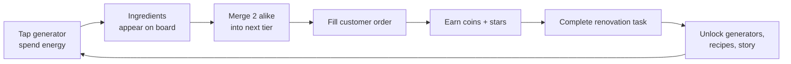

# Rise & Shine Bakery — Game Design Document

Sep 24, 2026 · @Scott

## Overview

Rise & Shine Bakery is a cozy merge game: players combine ingredients into baked goods, fill customer orders, and use the earnings to rebuild a family bakery into a thriving company. It runs in any desktop or mobile browser with no install.

**Premise.** The player inherits a run-down seaside bakery from their grandmother. Her recipe book is scattered, the ovens are cold, and a chain competitor, MegaBun Corp, wants the lot. Each chapter reopens a new part of the business, from the corner shop to a wholesale factory.

**Design pillars**

- **Satisfying merges.** Every merge pops, squishes, and smells good on screen. Tactile feedback is the core fun.
- **Always a next goal.** An order, a room to renovate, or a recipe to discover is always one or two merges away.
- **Short, complete sessions.** A meaningful session fits in 3–10 minutes.
- **Readable economy.** Players always understand what each currency does and never feel tricked.

**Audience and platform**

| Item | Target |
| --- | --- |
| Players | Casual players 18+, fans of merge and cozy management games |
| Platform | Desktop and mobile browsers; portrait layout first |
| Input | Mouse drag, touch drag, tap |
| Session length | 3–10 minutes, several per day |
| Comparable games | Merge Mansion, Travel Town, Gossip Harbor |

## Core loop

The loop is tap, merge, deliver, renovate. Tapping generators spends energy to spawn ingredients; merging climbs item chains; delivering orders pays coins and stars; stars fund renovation tasks that unlock story and new generators.

The inner loop (tap and merge) lasts seconds. The middle loop (an order) lasts one to three minutes. The outer loop (a renovation chapter) lasts several days of play.

## Merge mechanics

Two identical items merge into one item of the next tier. The board is a 7×9 grid (63 cells); space is the main constraint players manage.

**Board rules**

- Drag an item onto an identical item to merge. Dropping on a different item swaps them.
- Merging 5 identical items at once yields 2 next-tier items (a bonus for planning ahead).
- Locked cells start under crates or flour sacks. Merging next to them clears them, expanding the board.
- Cobwebbed items can be seen but not moved until the player merges a matching item into them.
- Items dragged off-board go to a **Pantry** (storage) with 4 slots at start, expandable to 12.
- A **Sell** bin turns unwanted items into a few coins, with a 10-second undo.

**Generators** are board items that spawn ingredients when tapped. Each tap costs 1 energy. Generators also merge: a higher-tier generator spawns higher-tier items and holds more charges before a cooldown.

**Feedback.** Valid merge targets glow when an item is lifted. A merge plays a squash-and-pop animation, a short chime that rises in pitch with tier, and a light haptic tap on mobile. A new item type triggers a one-time discovery card for the Recipe Book.

## Item chains

Launch ships 5 ingredient chains, 3 baked-goods chains, and the Oven, which turns combinations of ingredients into baked goods. Each chain has 6–9 tiers; tier value roughly doubles per step.

**Ingredient chains (spawned by generators)**

| Generator | Tier 1 → top tier |
| --- | --- |
| Flour Mill | Wheat stalk → Wheat bundle → Flour scoop → Flour bag → Flour sack → Dough ball → Bread loaf → Sourdough boule |
| Dairy Fridge | Milk splash → Milk bottle → Cream jug → Butter pat → Butter block → Cheese wedge → Cheese wheel |
| Hen Coop | Egg → Egg pair → Egg carton → Whisked eggs → Custard cup → Crème brûlée |
| Sugar Tin | Sugar cube → Sugar bowl → Syrup bottle → Caramel → Cocoa bean → Chocolate bar → Truffle box |
| Fruit Crate | Berry → Berry bunch → Apple → Apple basket → Jam jar → Fruit tart filling |

**The Oven (converter).** The Oven lives off the board, in a Kitchen overlay: drag ingredients onto the Oven button at the board's edge (or tap Send to Oven) to load a recipe, and it bakes on a timer (30 seconds to 4 hours by tier). Bakes can be rushed with gems. Finished bakes wait in the Kitchen until collected onto the board. Ovens upgrade by merging inside the Kitchen: Toaster Oven → Brick Oven → Deck Oven, each adding a bake slot and cutting bake time 20%.

| Recipe | Ingredients | Result |
| --- | --- | --- |
| Cookie | Flour bag + Sugar bowl + Egg | Cookie (merges: Cookie stack → Cookie tin → Gift hamper) |
| Croissant | Dough ball + Butter block | Croissant (merges: Pain au chocolat → Pastry platter) |
| Cupcake | Flour bag + Egg pair + Cream jug | Cupcake (merges: Cake slice → Layer cake → Wedding cake) |

**Rare drops.** 3% of generator taps spawn a bonus item: an energy jar, a coin pouch, or a Golden Whisk (a wildcard that copies any item it merges with, up to tier 5).

## Orders and customers

Customers queue at the counter above the board, each asking for 1–3 specific items. Up to 4 orders show at once; a completed order is replaced within 5 seconds.

**Order types**

| Type | What it asks | Reward |
| --- | --- | --- |
| Walk-in | 1–2 low-tier items | Coins, 1 star |
| Regular | 2–3 items from named customers with small storylines | Coins, 2–3 stars, friendship points |
| Catering | One high-tier item (e.g. Layer cake) within 24 hours | Large coin payout, 5 stars, generator upgrade chance |
| Wholesale (Chapter 4+) | A batch of 5–10 identical items | Coins, company reputation |

**Order generation rules**

- At least one open order is always fillable from items the player can currently produce.
- Orders weight toward items the next renovation task needs, so play feels directed.
- Orders never request an item tier the player has not yet discovered.

**Regular customers.** About 12 named townsfolk (the fisherman, the retired teacher, the MegaBun spy who secretly loves your scones). Friendship levels unlock favorite-order bonuses and short dialogue scenes.

## Economy

Four currencies, each with one clear job: energy gates play, coins buy things, stars drive progress, gems skip waiting.

| Currency | Earned from | Spent on |
| --- | --- | --- |
| Energy | Regenerates 1 per 2 minutes, cap 100; energy jars; level-ups | Generator taps (1 each) |
| Coins | Orders, selling items, coin pouches | Pantry slots, shop items, generator unlocks |
| Stars | Orders only | Renovation tasks (the story) |
| Gems | Level-ups, achievements, daily login | Rushing bakes and cooldowns, energy refills |

**Player level.** XP comes from every merge (tier × 1 XP). Each level-up refills energy and grants gems, so long sessions end on a high.

**Balancing targets**

- A full energy bar (100) funds roughly 8–10 minutes of play and 3–5 orders.
- A renovation task costs 3–8 stars, so each takes about one session.
- A free player finishes Chapter 1 in 2–3 days.

**Monetization (if any).** None at launch: this is a personal project, so gems are earned-only and there are no ads or purchases. If it launches publicly later, add optional gem packs and a cosmetic bakery-decor pass; no ads mid-merge, no loot boxes. Keep the gem economy behind one config so store items can slot in without rebalancing.

## Progression and chapters

The meta layer grows the business from one shop to a baking company across 5 chapters. Each chapter is a location with 15–25 renovation tasks paid in stars; finishing it unlocks the next location, new generators, and a story beat.

| Chapter | Location | New content | Story beat |
| --- | --- | --- | --- |
| 1 | Grandma's Corner Shop | Flour Mill, Dairy Fridge, Toaster Oven | Reopen the doors; find the first recipe page |
| 2 | The Café Terrace | Hen Coop, Sugar Tin, Cookie and Cupcake recipes | Win back the regulars from MegaBun |
| 3 | Harbor Market Stall | Fruit Crate, catering orders | Cater the town festival |
| 4 | The Wholesale Kitchen | Wholesale orders, Deck Oven | Supply the grocery chain; hire staff |
| 5 | Rise & Shine Factory | Automation helpers, chocolate line | Face MegaBun's buyout offer |

**Renovation tasks** show as highlighted spots in the location view (fix the awning, repaint the sign). Each completes with a short before/after animation, so progress is visible at a glance.

**Recipe Book.** A collection screen for every discovered item, with Grandma's handwritten notes. Completing a chain page grants gems.

**Staff (Chapter 4+).** Hired bakers are passive helpers: one auto-taps a generator every few minutes, another speeds a bake slot. They add a light company-management flavor without a second game mode.

## Competitive events

From Chapter 2, time-limited events pit the bakery against MegaBun Corp. The tone is underdog comedy: MegaBun is huge, rich, and relentlessly clueless, and the town always roots for the little shop. MegaBun is never menacing, just a corporation that has focus-grouped the joy out of bread.

**The rival.** MegaBun is fronted by CEO Chad Crustworth, who speaks only in press releases, and its mascot Buns-A-Lot, an intern in a sweaty bun costume. Its flagship product is the Artisanal Bread Product™, which contains "up to 40% bread."

**Event types**

| Event | How it plays | The joke | Top reward |
| --- | --- | --- | --- |
| Bake-Off Showdown | A 3-day score race. Event orders earn Hometown Pride points while MegaBun's progress bar climbs on a set curve. Pass it before the timer ends. | MegaBun's entry is a cake "designed by committee" that sags a bit more each day. | Trophy decor for the shop, gems |
| Street Fair Standoff | MegaBun opens a stall across the harbor. Every order filled pulls a customer out of their queue and into yours, shown live on the stall view. | Buns-A-Lot hands out coupons for 3% off, then 4%, then gets visibly desperate. | Event-only generator skin, friendship points |
| Blind Taste Test | Judges on the town square request 3 high-tier items in a row. Each correct delivery wins a round. | MegaBun's samples arrive microwaved in their plastic. One judge is Chad's mother, who votes for you. | Rare recipe page, gems |
| Flour Shortage | MegaBun has bought all the flour in town. The Flour Mill runs slower for the event, and a temporary Grandma's Secret Stash generator appears on the board. | MegaBun's legal department sends increasingly polite cease-and-desist letters about "unauthorized baking." | Permanent Flour Mill upgrade |
| Charity Bake Sale | A town-wide goal: raise more for the lighthouse fund than MegaBun's single giant novelty check. | The check bounces on the final day, but you still have to beat the posted amount. | Chapter-themed decor set |

**Structure**

- Events run 3–5 days, about one every two weeks, and never overlap.
- Each event places one event generator on the board. Its items can't mix with regular chains and turn into coins when the event ends, so the main board never gets clogged.
- A milestone track pays rewards at fixed point totals, so every session earns something even if MegaBun wins.
- MegaBun's score follows a scripted curve that a player can beat in 6–8 sessions. Losing costs nothing; the reward is a comic cutscene of Chad taking credit anyway.
- The MegaBun spy regular sends hint letters during events ("They're planning a croissant push Thursday. Also, your scones are incredible.").

**Tone rules.** Jokes punch up at corporate habits (buzzwords, mascots, shrinkflation), not at MegaBun's staff, who are shown as nice people stuck in bad jobs. A late-game event can let a MegaBun employee quit and join the bakery as a hired baker.

**Later option.** Bakery Alliances: groups of players pool Hometown Pride against one shared global MegaBun score. This is the only multiplayer layer and waits until after launch.

## UI and art direction

The look is warm, cute, and soft, drawn in high-quality flat vector: think a bakery at 6 a.m. with morning light through flour dust.

**Screen layout (portrait)**

- **Top bar:** energy, coins, stars, gems, player level.
- **Counter strip:** up to 4 customer portraits with order bubbles; tap to see details.
- **Board:** the 7×9 grid, taking about 60% of screen height. No Oven tile: an Oven button on the board's edge shows bake progress and opens the Kitchen overlay, a half-height sheet with oven slots and timers.
- **Bottom bar:** Pantry, Recipe Book, Bakery (location view), Shop, Settings.

On wide desktop screens, the location view sits beside the board instead of behind a tab.

**Art style**

- Style: polished flat vector (SVG) with soft gradients, rounded shapes, and subtle highlights so items feel cute, not clip-art. Keep art behind a sprite-keyed asset layer so it can swap to hand-painted sprites later without code changes.
- Palette: butter yellow, crust brown, strawberry pink, mint, cream backgrounds.
- Items: chunky, rounded silhouettes readable at 48 px; each tier adds size, shine, or garnish so tiers read at a glance.
- Characters: bust portraits with 3 expressions each (neutral, happy, impatient).
- Motion: squash-and-stretch on merge, steam wisps on fresh bakes, crumbs on sell.

**Accessibility.** Tier numbers toggle on for color-blind players, all text scales to 150%, and reduced-motion mode swaps pops for fades.

## Audio

Audio is gentle and rewarding, never nagging. Music loops are acoustic café jazz, one per location, at a low default volume.

- **Merge chime:** a marimba note that climbs a major scale with item tier.
- **Generator tap:** a soft thunk plus a material sound (flour puff, egg clack, fridge hum).
- **Order complete:** a shop bell and coin jingle.
- **Oven done:** a kitchen-timer ding, also sent as an optional browser notification.
- **Renovation complete:** a short brass sting.

Music and effects have separate volume sliders; audio starts muted until the first tap, as browsers require.

## Technical design

Build it as a single-page web app with a 2D canvas renderer and all game data in JSON, so balancing never needs a code change.

| Area | Choice |
| --- | --- |
| Language | TypeScript |
| Rendering | PixiJS (WebGL canvas) for the board; HTML/CSS overlays for menus |
| Build | Vite |
| State | One serializable game-state object; pure functions for merge, spawn, and order logic |
| Save | localStorage autosave every action, plus optional cloud save later |
| Offline timers | Store timestamps, not countdowns; energy and bakes resolve on load |
| Data | JSON files for items, chains, recipes, generators, orders, and chapters |
| Hosting | Static hosting; installable as a PWA |

**Key data shapes**

- `Item { id, chain, tier, sprite, sellValue }`
- `Generator { id, tier, spawnTable[{itemId, weight}], charges, cooldownSec }`
- `Recipe { id, inputs[itemId], output, bakeSec }`
- `Order { customerId, wants[itemId], reward{coins, stars, xp}, expiresAt? }`

**Performance targets.** 60 fps on a mid-range phone, under 5 MB initial download, first merge within 10 seconds of load.

## MVP scope and roadmap

The MVP proves the merge feel and one full chapter; everything else waits until that is fun.

| Milestone | Scope | Done when |
| --- | --- | --- |
| 1. Merge prototype | Board, drag/merge, 1 generator, 1 chain, placeholder art | Merging feels good with no goals attached |
| 2. Core loop | Orders, energy, coins, stars, Pantry, save/load | A 10-minute session has a clear goal and payoff |
| 3. Chapter 1 (MVP) | Corner Shop location, 2 generators, Oven, 20 renovation tasks, 4 regulars | A new player finishes Chapter 1 in 2–3 days |
| 4. Content | Chapters 2–3, Recipe Book, catering orders, audio pass | Playtesters return on day 3 |
| 5. Company layer | Chapters 4–5, wholesale, staff helpers, PWA polish | Full story playable end to end |

## Open questions

- [ ] Is energy the right gate, or should generators use only cooldowns for a friendlier feel?
- [x] Keep the MegaBun rivalry light and comic, or add competitive events against it?
- [x] Art: commission hand-painted sprites, or use a flat vector style that is faster to produce?
- [x] Should the Oven stay a board item, or move to a separate kitchen screen to free board space?
- [x] Any monetization at all, or a free portfolio release?
