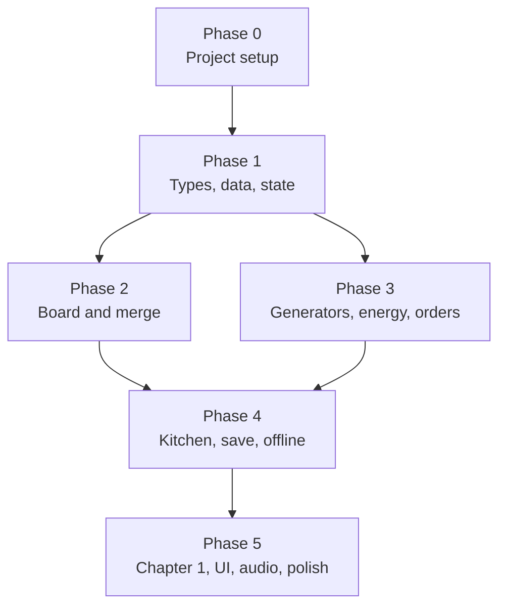

# Rise & Shine Bakery — Implementation Plan

Sep 24, 2026 · updated Oct 2, 2026 · @Scott

## Approach

This plan builds the MVP from the GDD: a playable Chapter 1 (Grandma's Corner Shop) in the browser, with no monetization. It splits the work into 57 small tasks, each sized for one Sonnet or Haiku session, plus a short list of work kept for Opus or Scott.

**Who does what**

| Model | Gets | Typical size |
| --- | --- | --- |
| Haiku | Data entry, config, CSS, single pure functions with an exact spec, unit tests from a given table | 1 file, under 150 lines |
| Sonnet | A feature across 2–4 files, rendering, input handling, UI screens, refactors with tests | 2–4 files, under 400 lines |
| Opus / Scott | Architecture, the type contracts, balancing, integration reviews at phase ends | Decisions and reviews |

**Handoff rules**

- One task, one branch, one pull request. Merge only when its "Done when" check passes.
- Game logic lives in `src/core/` as pure TypeScript functions with no rendering or DOM imports. This is what makes most tasks safe to hand to small models.
- The contracts in `src/core/types.ts` (task T1.1) are frozen after review. Handed-off tasks may not edit them; they flag a needed change instead.
- Every core task ships with Vitest tests. Rendering tasks ship with a manual check listed in "Done when."
- Numbers (energy regen, costs, drop rates) come from JSON in `src/data/`, never hard-coded.

**Scope.** Phases 0–5 built the Chapter 1 MVP. Phase 7 added Chapter 2 and the Shop. Phases 8–12 (below) cover the MegaBun events, Chapters 3–5 and a whole-game pass, so the plan now reaches the full five-chapter story. Cloud save and Bakery Alliances stay out of scope.

## Task brief template

Paste this into the model's session for every handed-off task. Small models do best when the brief names the files, the contract, and the exact check.

```markdown
# Task <ID>: <title>

Context: Rise & Shine Bakery, a browser merge game (TypeScript, Vite, PixiJS, Vitest).
Read first: src/core/types.ts, <other files>.

Goal: <one sentence>.

Files to create or edit: <list>. Do not edit any other file.
Contract: <function signatures or JSON shape>.
Rules: pure functions in src/core; no new dependencies; no edits to types.ts.

Done when: <the check from the plan>, and npm run typecheck passes (Vitest does not typecheck).
If the contract seems wrong, stop and explain instead of changing it.
```

## Dependency map

Phases run in order, but tasks inside a phase mostly run in parallel. Phase 1's types gate everything after it.



Phases 2 and 3 can run side by side: Phase 2 is mostly rendering, Phase 3 mostly core logic.

## Phase 0: Project setup

Five setup tasks, all parallel except T0.3, which needs the scaffold.

| ID | Task | Model | Depends on | Done when |
| --- | --- | --- | --- | --- |
| T0.1 | Scaffold Vite + TypeScript (strict) + Vitest + ESLint + Prettier; add `pixi.js` and `zod` | Haiku | — | `npm run dev` serves a blank page; `npm test` passes one sample test |
| T0.2 | Create folders `src/core`, `src/data`, `src/render`, `src/ui`, `src/audio`, `public/art`; write README with the handoff rules | Haiku | T0.1 | Folders exist; README lists the rules from Approach |
| T0.3 | PixiJS app shell: canvas in a portrait container (max 480 px wide), resizes with the window, HTML overlay root above it | Sonnet | T0.1 | Canvas fills the column on phone and desktop sizes with no scrollbars |
| T0.4 | GitHub Actions workflow: lint, typecheck, test on every pull request | Haiku | T0.1 | A pull request shows three passing checks |
| T0.5 | `tokens.css` with the GDD palette (butter, crust, strawberry, mint, cream), spacing scale, font stack, and a `--text-scale` variable | Haiku | T0.1 | Tokens load globally; a test page shows each color swatch |

## Phase 1: Types, data, and state

T1.1 is the one gate: Opus drafts the contracts, Scott approves them, then the eight data and state tasks run in parallel.

| ID | Task | Model | Depends on | Done when |
| --- | --- | --- | --- | --- |
| T1.1 | Write `src/core/types.ts`: Item, Chain, Generator, Recipe, Oven, Order, Customer, RenovationTask, GameState, Action | Opus | T0.2 | Scott approves; file marked frozen |
| T1.2 | `items.json`: Flour and Dairy chains from the GDD, with tier, spriteKey, sellValue doubling per tier (tier 1 = 1 coin) | Haiku | T1.1 | Validator (T1.7) passes |
| T1.3 | `items.json`: Egg, Sugar, Fruit chains plus Cookie, Croissant, Cupcake baked-goods chains and generator items | Haiku | T1.2 | Validator passes; every GDD item present |
| T1.4 | `generators.json`: Flour Mill and Dairy Fridge tiers 1–3 with spawn weights, charges, cooldownSec; 3% rare-drop table | Haiku | T1.1 | Validator passes; weights per table sum to 100 |
| T1.5 | `recipes.json` (Cookie, Croissant, Cupcake) and `ovens.json` (Toaster, Brick, Deck: slots 1/2/3, bake-time multiplier 1.0/0.8/0.64) | Haiku | T1.1 | Validator passes |
| T1.6 | `economy.json`: energy cap 100, regen 120 s, XP = tier, level curve, pantry slots 4→12 with coin costs, rush cost per minute | Haiku | T1.1 | Validator passes |
| T1.7 | Data loader: load all JSON, validate with zod, check cross-references (every itemId exists, chain tiers contiguous) | Sonnet | T1.1 | Tests fail on a broken fixture and pass on real data |
| T1.8 | `createNewGame()` and a `dispatch(state, action)` reducer skeleton that routes each Action type to a stub; also writes src/data/newGame.json, the starting board | Sonnet | T1.1 | Tests: new game has 63 cells, starting generators placed, locked cells set |
| T1.9 | Seeded RNG (`mulberry32`) and `weightedPick(table, rng)` | Haiku | T0.1 | Tests: same seed gives same sequence; 10,000 picks land within 2% of weights |

## Phase 2: Board and merge

Core rules first (T2.1–T2.5), then rendering and input. Milestone 1 from the GDD, "merging feels good," is reached at T2.8.

| ID | Task | Model | Depends on | Done when |
| --- | --- | --- | --- | --- |
| T2.1 | `core/board.ts`: `getCell`, `setCell`, `emptyCells`, `nearestEmpty(from)` on the 7×9 grid | Haiku | T1.8 | Tests cover corners, a full board, and nearest-by-distance ties |
| T2.2 | `core/merge.ts`: `canMerge(a, b)` and `nextTier(item)` (null at top tier) | Haiku | T1.7 | Tests: same item merges, different items and top tiers don't |
| T2.3 | `applyDrop(state, from, to)`: merge, swap, or move; cobwebbed items accept only a matching merge | Sonnet | T2.1, T2.2 | Tests for each outcome, including dropping on a locked cell (rejected) |
| T2.4 | Five-merge bonus: when a drop joins a connected group of 5 identical items, output 2 next-tier items | Sonnet | T2.3 | Tests: 5 gives 2, 4 gives the normal result, 6 leaves one behind |
| T2.5 | `clearAdjacentLocks(state, cell)`: a merge next to a crate or flour sack opens it | Haiku | T2.1 | Tests: orthogonal neighbors open, diagonals don't |
| T2.6 | Asset registry: `spriteKey → URL`, with a fallback placeholder | Haiku | T1.3 | Missing keys show the placeholder, not an error |
| T2.7 | Placeholder SVGs: one per item, a colored rounded square with chain color and tier number | Haiku | T1.3 | Every item in `items.json` has a file in `public/art/` |
| T2.8 | BoardView: render cells, locks, cobwebs, and items from state; drag and drop with mouse and touch; valid targets glow while dragging | Sonnet | T2.3, T2.6 | Merging works on a phone and in a desktop browser |
| T2.9 | Merge and sell animations: squash-and-pop, crumb burst; fade versions under reduced motion | Sonnet | T2.8 | Animations run at 60 fps on a mid-range phone |
| T2.10 | Sell bin: `sellItem` and `undoSell` within 10 s, plus the bin UI | Haiku | T2.8 | Tests for undo inside and outside the window; bin works in browser |

## Phase 3: Generators, energy, and orders

This phase turns merging into the core loop. It can run alongside Phase 2 because nearly all of it is core logic.

| ID | Task | Model | Depends on | Done when |
| --- | --- | --- | --- | --- |
| T3.1 | `core/energy.ts`: `currentEnergy(value, since, now)` using regen and cap from `economy.json` | Haiku | T1.6 | Tests: partial regen, cap, clock going backwards (no change) |
| T3.2 | `tapGenerator(state, cell, rng, now)`: spend 1 energy, spawn to nearest empty, track charges and cooldown, roll the rare-drop table; also collectBonus: tapping an energy jar or coin pouch grants its reward and removes it | Sonnet | T2.1, T3.1, T1.9 | Tests: no energy, full board, cooldown, seeded rare drop |
| T3.3 | Golden Whisk rule: merging it with any item up to tier 5 makes a copy | Haiku | T2.3 | Tests: tier 5 copies, tier 6 is rejected |
| T3.4 | `core/pantry.ts`: store, retrieve, capacity, `buySlot` with coin cost | Haiku | T1.6 | Tests: full pantry, not enough coins, slot cap 12 |
| T3.5 | `customers.json`: 4 Chapter 1 regulars and a walk-in pool, with favorite items and portrait keys | Haiku | T1.1 | Validator passes |
| T3.6 | `generateOrder(state, rng)`: follows the GDD rules (one always fillable, weighted to renovation needs, discovered items only) | Sonnet | T3.5 | Tests check each rule over 500 seeded orders |
| T3.7 | `deliverOrder(state, orderId)`: find items on board, remove them, grant coins, stars, XP; refill queue within 5 s | Haiku | T3.6 | Tests: partial items (rejected), success, rewards match data |
| T3.8 | `core/level.ts`: `addXp`, level curve, level-up refills energy and grants gems | Haiku | T1.6 | Tests: single and multiple level-ups in one call |
| T3.9 | Counter strip UI: up to 4 portraits with order bubbles; bubbles show which items are on the board; Deliver button when fillable | Sonnet | T3.7, T2.8 | Full loop playable: tap, merge, deliver |
| T3.10 | Top bar HUD: energy (with time to next point), coins, stars, gems, level | Haiku | T3.1 | Values update live; timer counts down correctly |
| T3.11 | Pantry drawer UI: drag items in and out; buy-slot button | Sonnet | T3.4, T2.8 | Items survive round trips; buying a slot deducts coins |

## Phase 4: Kitchen, save, and offline timers

The Oven lives off the board in the Kitchen overlay, per the updated GDD. All timers store timestamps, so save and offline tasks share one rule: resolve from `now` on load.

| ID | Task | Model | Depends on | Done when |
| --- | --- | --- | --- | --- |
| T4.1 | `core/kitchen.ts`: `loadRecipe(state, slot, recipeId, cells)` checks inputs, removes them, starts a bake with `startedAt` | Haiku | T1.5, T2.1 | Tests: missing input, busy slot, success |
| T4.2 | `bakeStatus(slot, now)`, `collectBake` (to nearest empty cell, else pantry, else stays waiting), `rushBake` with gem cost | Haiku | T4.1, T3.4 | Tests: in progress, done, full board and pantry, rush cost |
| T4.3 | Oven upgrades: merging two identical ovens in the Kitchen makes the next tier, adding a slot and applying the time multiplier. If the running bakes won't fit the new oven (two busy Brick Ovens hold 4 bakes; a Deck Oven has 3 slots), reject the merge or handle it | Sonnet | T4.1 | Tests: running bakes keep their end time; new slot appears |
| T4.4 | Kitchen overlay UI: Oven button on the board edge with progress ring; half-height sheet with slots and timers; drag-to-Oven and Send to Oven | Sonnet | T4.2, T2.8 | A recipe can be loaded, baked, rushed, and collected in browser |
| T4.5 | `core/save.ts`: serialize and deserialize GameState with a version number; localStorage wrapper in try/catch | Haiku | T1.8 | Round-trip test gives an identical state; corrupt data falls back to a new game |
| T4.6 | `migrate(save)` scaffold with one example migration (v1 → v2) | Haiku | T4.5 | Test migrates a v1 fixture |
| T4.7 | Autosave: debounce a save 500 ms after any dispatched action and on page hide | Haiku | T4.5 | Reloading mid-session restores the board exactly |
| T4.8 | Offline resolution on load: energy, bakes, generator cooldowns; "While you were away" summary card | Sonnet | T4.7, T3.1, T4.2 | Tests with a fake clock at +1 min, +3 h, +3 days |
| T4.9 | Opt-in browser notification when a bake finishes while the tab is hidden | Haiku | T4.4 | Notification fires once; off by default in settings |

## Phase 5: Chapter 1, UI, audio, and polish

This phase makes Chapter 1 a complete experience. Art tasks produce the final flat vector SVGs through the asset registry, so a later switch to sprites touches only `public/art/`.

| ID | Task | Model | Depends on | Done when |
| --- | --- | --- | --- | --- |
| T5.1 | `chapter1.json`: 20 renovation tasks for the Corner Shop (name, star cost 3–8, spot position, prerequisites, unlocks) | Haiku | T1.1 | Validator passes; total cost fits the 2–3 day target set in T-O3 |
| T5.2 | `core/renovation.ts`: `completeTask` spends stars, checks prerequisites, applies unlocks | Haiku | T5.1 | Tests: locked, too few stars, success with unlock |
| T5.3 | Location view: shop scene with tappable task spots and before/after swap animation | Sonnet | T5.2 | All 20 tasks can be completed in order in browser |
| T5.4 | Dialogue player: reads dialogue JSON, shows portrait and text box, tap to advance, skip button | Sonnet | T1.1 | A sample script plays end to end |
| T5.5 | Chapter 1 dialogue: intro, first recipe page, reopening day, one short scene per regular, with the underdog-comedy tone | Sonnet | T5.4, T3.5 | Scott approves the script |
| T5.6 | Recipe Book: pages per chain, discovered items with Grandma's notes, gems on chain completion | Sonnet | T1.3 | Discovering an item fills its slot; completing a chain pays once |
| T5.7 | Discovery card popup the first time an item is made | Haiku | T5.6 | Shows once per item, never again after reload |
| T5.8 | Bottom nav bar and screen router: Pantry, Recipe Book, Bakery, Shop, Settings | Haiku | T0.3 | Each tab opens its screen; back returns to the board |
| T5.9 | Settings: music and effects sliders, reduced motion, tier numbers, text scale to 150%, notifications, reset save (with confirm) | Sonnet (was Haiku: each setting reaches a different part of the game) | T5.8 | Each setting persists across reloads |
| T5.10 | Audio manager on Web Audio: music and effects buses, starts after first tap, merge chime pitch by tier | Sonnet | T0.1 | Chime climbs a major scale across tiers 1–8 |
| T5.11 | `sfx.json` map and event wiring: tap, merge, deliver, oven done, renovation | Haiku | T5.10 | Every GDD sound event plays its file |
| T5.12 | First-time flow: guided first tap, first merge, first order, first renovation, with pointer hints | Sonnet | T5.3, T3.9 | A new save reaches the first renovation without confusion in a playtest |
| T5.13 | PWA: manifest, icons, service worker via `vite-plugin-pwa` (the one approved new dependency) | Haiku | T0.1 | Installable on Android and desktop Chrome; works offline |
| T5.14 | Final item art as 16 × 16 pixel-art PNGs (changed from flat vector SVGs by Scott), in six batches: eggs, sugar, fruit, baked goods, generators, bonus items | Sonnet | T2.6 | Each chain's tiers read at 48 px; Scott approves each batch |

## Added during the build

Work that wasn't in the original task list, done while building Phases 4 and 5.

| What | Why |
| --- | --- |
| Pixel art pipeline: `assetUrl()` prefers a key's `.png` over its `.svg`, PixiJS textures scale nearest-neighbour, HTML images use `image-rendering: pixelated`; app icons drawn from the croissant | The game's art moved to 16 × 16 pixel art; every one of the 60 items now has a PNG |
| "?" button and How to play dialog | New players had no explanation of merging or baking |
| Per-generator cooldown timer on the board | A spent generator looked identical to a working one |
| Hen Coop and Sugar Tin, three tiers each, in the data but not on the starting board | Cookie and Cupcake need eggs and sugar; per the GDD these generators arrive in Chapter 2 |
| The Kitchen lists only recipes whose inputs the player can currently get (`producibleChains` in orders.ts, shared with order generation) | Recipes shouldn't ask for items the player has no way to make |
| Chain-completion gems in `discover` (folded into T5.6) | The GDD and `completionGems` promised them; nothing paid them |
| `createDispatch` keeps the state object when nothing changed (T-O2 fix) | The idle one-second `tick` was redrawing the board, autosaving and rebuilding the Kitchen every second |
| Dev-only console helpers: `bakery.give`, `bakery.stars`, `bakery.away`, `bakery.reset` (absent from production builds) | Browser checks needed items, stars and elapsed time without grinding |
| Synthesized audio: every sound is Web Audio tones described in `sfx.json` | No audio files exist; music has a volume channel but no track yet |

## Phase 6: Art and loose ends

Open items found during the build. T6.1–T6.3 follow T5.14's art process: pixel art in the same style, shown to Scott at 8× per batch before it goes into `public/art/`.

| ID | Task | Model | Depends on | Done when |
| --- | --- | --- | --- | --- |
| T6.1 | Portraits, 25 files at 32 × 32: the four regulars (a counter portrait plus neutral, happy and impatient each), Grandma (three expressions, framed like a photo), six walk-ins. Or 21 if the counter reuses each regular's neutral portrait (a one-line change in counterModel.ts) | Sonnet | T5.14 | Every portrait key in customers.json and the Chapter 1 script has a PNG; Scott approves each batch |
| T6.2 | The Corner Shop scene (96 × 128) and its 40 renovation before/after pictures (32 × 32), same framing in each pair so the cross-fade lines up | Sonnet | T5.3, T6.1 (style) | Every `sceneKey` and task sprite key in chapter1.json has a PNG; Scott approves each batch |
| T6.3 | Oven art (`toaster-oven`, `brick-oven`, `deck-oven`, 16 × 16) and showing it beside each oven's name in the Kitchen sheet | Sonnet | T5.14 | The Kitchen shows each oven's art; tiers read at a glance |
| T6.4 | Remaining charges on each generator, a small count on its cell | Haiku | T5.9 (tier-badge placement) | The count drops with each tap and hides during the cooldown overlay |
| T6.5 | Rush a generator's cooldown with gems, priced like `rushBake`. Contract change approved under T-O1: `rushCooldown` action, `cooldownRushed` event. Done | Opus (contract), then Sonnet | T-O1 approval | A spent generator can be rushed for gems; the cost matches `rushGemsPerMinute` |
| T6.6 | Chapter 2 renovation tasks that unlock the Hen Coop and Sugar Tin (and with them Cookie and Cupcake) | Part of the next plan (T-O6) | T-O6 | — |
| T6.7 | Fruit Crate generator, once a recipe uses fruit (Chapter 3 in the GDD) | Folded into T9.1 | — | — |

## Phase 7: Chapter 2, The Café Terrace, and the Shop

Chapter 1 passed its playtest (T-O5, Oct 1). Chapter 2 is the GDD's Café Terrace: the Hen Coop and Sugar Tin arrive, and with them the Cookie and Cupcake recipes, while the shop wins its regulars back from MegaBun. It also adds the Shop, the coin sink the T-O3 pass found missing. The MegaBun competitive events wait for Phase 8.

**Contract change (T-O1), to approve before T7.2 and T7.8.** In `types.ts`:

- `ShopItemId`, and `ShopItem { id, name, kind: 'generator' | 'energy', itemId?, energy?, price, fromChapter }`, with a `ShopFile` for `src/data/shop.json` and `GameData.shop: ReadonlyMap<ShopItemId, ShopItem>`.
- Action `{ type: 'buyShopItem'; shopItemId }`. Rejects reuse `notEnoughCoins` and `boardFull`.
- Events `{ type: 'purchased'; shopItemId; coins }` and `{ type: 'chapterStarted'; chapterId }`.
- No change to `GameState`, so saves need no migration. Prices are fixed; a price that rises with each purchase would need a purchase count in the save and a v1 to v2 migration, so it waits until the balance pass shows a need.

| ID | Task | Model | Depends on | Done when |
| --- | --- | --- | --- | --- |
| T7.1 | The contract change above; dispatch cases for the new action; the loader and validator for `shop.json`; task ids unique across all chapters | Opus | Scott's approval | Typecheck passes; the loader rejects a duplicate task id across chapters |
| T7.2 | Chapter progression: completing a chapter's last task moves `chapterId` to the next chapter in data order and emits `chapterStarted`. The last chapter stays put | Sonnet | T7.1 | Tests: mid-chapter, the last task, the final chapter |
| T7.3 | Three new regulars for Chapter 2 in `customers.json`, with favourite items from the egg, sugar, cookie and cupcake chains, plus their portraits (neutral, happy, impatient: 9 files) | Sonnet | T6.1 (style) | The loader accepts them; Scott approves the portraits |
| T7.4 | `chapter2.json`: The Café Terrace's 20 tasks. Early tasks unlock the Hen Coop and the Sugar Tin (folds in T6.6), the rest the new regulars and a few extra generators; featured items lean on eggs, sugar, cookies and cupcakes. Ids prefixed `cafe-` so they can't collide with Chapter 1 | Sonnet | T7.2, T7.3 | The loader accepts it; a full-chapter test like chapter1.test.ts |
| T7.5 | Chapter transition in the UI: a "Chapter complete" card when `chapterStarted` arrives, the next chapter's intro scene, the Bakery switching to the new location | Sonnet | T7.2 | A browser run from Chapter 1's last task into Chapter 2 |
| T7.6 | Chapter 2 dialogue: the intro (MegaBun has opened a kiosk across the lane and the regulars are drifting), a scene per new regular, the four Chapter 1 regulars coming back, and a finale | Sonnet | T7.3, T7.4, T5.4 | Scott approves the script; `missingSceneIds` is empty |
| T7.7 | Café Terrace art: the scene (96 × 128) and its 40 before/after pictures, made the T6.2 way | Sonnet | T7.4 | Every chapter 2 sprite key has a PNG; Scott approves each batch |
| T7.8 | The Shop: `shop.json` (extra generators of each kind unlocked so far, and energy refills), core `buyShopItem` placing a generator like a renovation unlock, and the Shop screen replacing "Coming soon", with Pantry slots listed there too | Sonnet | T7.1 | Buying spends coins and places the item; unaffordable and locked rows are disabled |
| T7.9 | Balance pass (T-O3): extend the simulator to play across chapters and use the Shop; tune Chapter 2's task costs and the Shop's prices | Opus | T7.4, T7.8 | Chapter 2 takes about 2–3 days after Chapter 1, and coins have somewhere to go |
| T7.10 | Phase-end review (T-O2) and a Chapter 2 playtest (T-O5) | Opus, then Scott | All above | Lint, typecheck, tests and build pass; Scott plays Chapter 2 through |

## The road to all five chapters

Phases 8–12 finish the GDD's story: the MegaBun events, then Chapters 3, 4 and 5, then a launch pass. Each chapter phase repeats Phase 7's shape (contract change if needed, systems, data, regulars, dialogue, art, balance, review and playtest), so a chapter's tasks follow the same order and the same approval gates. The events come first because the GDD wants them from Chapter 2 and they give the early chapters their replay value; Chapters 3–5 then each add one event type and one system.

| Phase | Chapter / scope | New systems | GDD story beat |
| --- | --- | --- | --- |
| 8 | MegaBun events (Chapter 2 on) | Event generator, Hometown Pride, milestone track, rival score curve | Underdog comedy against MegaBun |
| 9 | Chapter 3: Harbor Market Stall | Fruit Crate, fruit recipes, catering orders | Cater the town festival |
| 10 | Chapter 4: The Wholesale Kitchen | Wholesale orders, reputation, Deck Oven in the Shop, staff | Supply the grocery chain; hire staff |
| 11 | Chapter 5: Rise & Shine Factory | Automation helpers, chocolate line, finale | Face MegaBun's buyout offer |
| 12 | Whole-game pass | Cross-chapter balance, full playthrough, polish | Full story playable end to end |

Each chapter keeps the GDD's target of 15–25 renovation tasks (Chapters 1 and 2 use 20) and about 2–3 days of play. Ids are prefixed per chapter (`cafe-`, `harbor-`, `wholesale-`, `factory-`) so they stay unique across files.

## Phase 8: MegaBun competitive events

**Status (Oct 3):** T8.1–T8.9 built; T8.7's script awaits Scott's approval and T8.10's playtest is his. Differences from the plan: the contract also gained `EventDef.gapAfterSec`, `orders`, `slow`, chain kind `event` and `EventResult.coins`; event art is placeholder SVG; the permanent rewards and the spy regular are not built. See `docs/HANDOFF.md`.

Available once Chapter 2 is reached. Five event types, built one at a time on a shared event framework. The Bake-Off Showdown ships first and proves the framework; the others reuse it. Events are limited to 3–5 days, about one every two weeks, and never overlap.

**Contract change (T-O1), to approve before T8.1.** In `types.ts`: an `EventState` in `GameState` (active event id, start and end timestamps, points, claimed milestones, MegaBun's score) and the actions `startEvent`, `deliverEventOrder`, `claimMilestone`. This is a `GameState` change, so it needs a save migration (v1 to v2, using the T4.6 scaffold).

| ID | Task | Model | Depends on | Done when |
| --- | --- | --- | --- | --- |
| T8.1 | The contract change above, the v1 to v2 migration, and `events.json` (event types, durations, milestone tracks, MegaBun's score curve) with loader and validator | Opus | Scott's approval | Typecheck passes; an old save loads with no active event |
| T8.2 | `core/events.ts`: schedule (one event per ~2 weeks, never overlapping), `startEvent`, expiry, and MegaBun's score as a pure function of elapsed time. A player can beat the curve in 6–8 sessions | Sonnet | T8.1 | Tests: start, expiry, no overlap, the score at fixed times |
| T8.3 | Event generator: one per event, placed on the board. Its items can't merge with regular chains and turn into coins when the event ends | Sonnet | T8.2 | Tests: no cross-chain merges, conversion at expiry, no leftovers |
| T8.4 | Event orders and Hometown Pride: event orders in the counter queue, points on delivery, the milestone track paying at fixed totals | Sonnet | T8.2 | Tests: points, each milestone pays once, a lost event still pays reached milestones |
| T8.5 | Event UI: banner with timer, progress bar against MegaBun, milestone track, event generator art, result card (win or lose with Chad's comic cutscene) | Sonnet | T8.4 | A full event can be played in a browser |
| T8.6 | Bake-Off Showdown: `events.json` entry, event orders, the sagging committee cake, trophy decor and gem rewards | Sonnet | T8.5 | Scott plays one event start to finish |
| T8.7 | Dialogue and the MegaBun spy regular: hint letters during events, a comic scene per event, tone rules from the GDD (jokes punch up at corporate habits, never at staff) | Sonnet | T8.5 | Scott approves the script |
| T8.8 | Remaining event types, one task each, reusing the framework: Street Fair Standoff (customers move queues), Blind Taste Test (3 high-tier items in a row), Flour Shortage (slower Flour Mill, temporary Grandma's Secret Stash), Charity Bake Sale (shared town goal) | Sonnet | T8.6 | Each type plays through; the permanent rewards (Flour Mill upgrade, decor sets) persist |
| T8.9 | Balance pass (T-O3): the simulator plays events; tune curves, milestone totals and rewards so losing costs nothing and winning takes 6–8 sessions | Opus | T8.8 | The bot beats a Bake-Off in the target number of sessions |
| T8.10 | Phase-end review (T-O2) and an events playtest (T-O5) | Opus, then Scott | All above | Lint, typecheck, tests and build pass; Scott plays two events |

## Phase 9: Chapter 3, Harbor Market Stall

**Status (Oct 3):** T9.1–T9.8 built; the Chapter 3 portraits, script and art await Scott's approval, and T9.9's playtest is his. Differences from the plan: catering's contract is `Order.catering` plus `OrderRules.catering` (no `kind` field) and two events; a new `OrderRules.lowTierBias` was needed to keep late orders affordable. See `docs/HANDOFF.md`.

The Fruit Crate arrives (folds in T6.7), a recipe finally uses fruit, and catering orders begin. The story beat is catering the town festival.

**Contract change (T-O1), if needed.** The GDD's catering order carries a 24-hour deadline, a large coin payout, 5 stars and a generator-upgrade chance. `Order` already allows `expiresAt`; check whether the type needs a `kind` field and a catering reward shape before T9.2.

| ID | Task | Model | Depends on | Done when |
| --- | --- | --- | --- | --- |
| T9.1 | Fruit recipes (at least a fruit tart and a pastry that uses fruit), added to `recipes.json`, and the Fruit Crate generator and tiers in `generators.json`. Kitchen and order generation pick them up through `producibleChains` | Haiku | Phase 7 | The validator passes; the Kitchen lists the fruit recipes once the Crate exists |
| T9.2 | Catering orders: one high-tier item within 24 hours, large coins, 5 stars, a generator-upgrade chance. Generation rules, expiry, a place in the counter queue | Sonnet | T9.1, T-O1 if needed | Tests: one at most at a time, expiry, reward rolls on a seeded rng |
| T9.3 | Catering UI: a distinct card in the counter strip with a countdown | Sonnet | T9.2 | A catering order can be seen, filled and expired in a browser |
| T9.4 | Three new regulars for Chapter 3 and their portraits (9 files) | Sonnet | T7.3 (style) | The loader accepts them; Scott approves the portraits |
| T9.5 | `chapter3.json`: 20 tasks (ids `harbor-`), unlocking the Fruit Crate, the new regulars and the festival stall; the Shop gains Chapter 3 rows (`fromChapter: 3`) | Sonnet | T7.2, T9.1, T9.4 | The loader accepts it; a full-chapter test |
| T9.6 | Chapter 3 dialogue: intro, scenes for the new regulars, the festival finale | Sonnet | T9.4, T9.5 | Scott approves the script; `missingSceneIds` is empty |
| T9.7 | Harbor Market Stall art: scene (96 × 128), 40 before/after pictures, fruit recipe items, Fruit Crate tiers | Sonnet | T9.5 | Every Chapter 3 sprite key has a PNG; Scott approves each batch |
| T9.8 | Balance pass (T-O3): Chapters 1–3 end to end, catering payouts and Shop prices | Opus | T9.5 | Chapter 3 takes about 2–3 days; catering is worth doing but never required |
| T9.9 | Phase-end review (T-O2) and a Chapter 3 playtest (T-O5) | Opus, then Scott | All above | Lint, typecheck, tests and build pass; Scott plays Chapter 3 through |

## Phase 10: Chapter 4, The Wholesale Kitchen

**Status (Oct 3):** T10.1–T10.10 built on branches `t10.*`; portraits, script and art await Scott's approval, and T10.11's playtest is his. Differences from the plan: `Order.wholesale` carries only an expiry (reputation sits on the reward); `StaffDef` gained `maxCatchUp`, `portraitKey` and `minChapter`; the Deck Oven comes from a renovation task, not the Shop. See `docs/HANDOFF.md`.

The business becomes a company: wholesale orders, the Deck Oven, and staff. This is the first chapter that adds a persistent system to `GameState`.

**Contract change (T-O1), to approve before T10.1.** In `types.ts`: a `wholesale` order kind (a batch of 5–10 identical items, paying coins and company reputation), `reputation` in `GameState`, and `Staff { id, role, assignedTo, lastActedAt }` with actions `hireStaff` and `assignStaff`. A `GameState` change, so another save migration.

| ID | Task | Model | Depends on | Done when |
| --- | --- | --- | --- | --- |
| T10.1 | The contract change above, its migration, `staff.json` (roles, hire costs, intervals) with loader and validator | Opus | Scott's approval | Typecheck passes; old saves load with no staff and zero reputation |
| T10.2 | Wholesale orders: generation (one chain at a time, 5–10 identical items), delivery from board and Pantry, reputation payout | Sonnet | T10.1 | Tests: batch size, partial batches rejected, reputation granted |
| T10.3 | Staff core: an auto-tap baker (taps one generator every few minutes) and a bake helper (speeds a slot), resolved from timestamps like cooldowns so offline play works | Sonnet | T10.1 | Tests: ticks at fixed times, offline catch-up through the T4.8 path, no energy spent from nothing |
| T10.4 | Wholesale and staff UI: wholesale card with a progress count, a Staff screen to hire and assign | Sonnet | T10.2, T10.3 | Hire, assign, fill a wholesale order in a browser |
| T10.5 | Deck Oven: the Chapter 4 renovation and a Shop row put one on the board; the Kitchen already handles the merge upgrade (T4.3) | Haiku | T7.8 | A Deck Oven with 3 slots is reachable from the Shop |
| T10.6 | Three new regulars (including a grocery-chain buyer) and their portraits (9 files); staff portraits (2 to 3) | Sonnet | T7.3 (style) | The loader accepts them; Scott approves the portraits |
| T10.7 | `chapter4.json`: 20 tasks (ids `wholesale-`), unlocking staff, wholesale and the new regulars | Sonnet | T10.2, T10.6 | The loader accepts it; a full-chapter test |
| T10.8 | Chapter 4 dialogue: intro, hiring scenes (a MegaBun employee may quit and join as a baker, per the GDD), the grocery-chain deal | Sonnet | T10.6, T10.7 | Scott approves the script |
| T10.9 | Wholesale Kitchen art: scene, 40 before/after pictures, staff sprites | Sonnet | T10.7 | Every Chapter 4 sprite key has a PNG; Scott approves each batch |
| T10.10 | Balance pass (T-O3): wholesale payouts, staff costs and intervals. Staff must help without making taps pointless | Opus | T10.7 | Chapter 4 takes about 2–3 days; a staffed board still needs the player |
| T10.11 | Phase-end review (T-O2) and a Chapter 4 playtest (T-O5) | Opus, then Scott | All above | Lint, typecheck, tests and build pass; Scott plays Chapter 4 through |

## Phase 11: Chapter 5, Rise & Shine Factory

**Status (Oct 3):** T11.1–T11.7 built on branches `t11.*`; the Chapter 5 portraits, script and art await Scott's approval, and T11.8's playthrough is his. Decisions: automation is an Auto-Oven staff role (no new save shape), and the game has one ending. Differences from the plan: the finale is a refusal scene on the last task plus a "The End" card; the MegaBun cast speak through a table in `dialogue.ts`. See `docs/HANDOFF.md`.

The finale. Automation helpers extend Phase 10's staff, the chocolate line completes the sugar chain's top tiers (cocoa bean to truffle box already exist as items), and the story ends with MegaBun's buyout offer.

| ID | Task | Model | Depends on | Done when |
| --- | --- | --- | --- | --- |
| T11.1 | Chocolate line recipes (chocolate cake, truffle box and friends) in `recipes.json`; the Kitchen and orders pick them up | Haiku | Phase 7 | The validator passes; recipes appear once Cocoa bean is reachable |
| T11.2 | Automation helpers: machines that run a generator or a recipe on a loop, built on Phase 10's staff timestamps (no new save shape if `Staff` allows a `machine` role; otherwise a T-O1 change) | Sonnet | T10.3 | Tests: loops, offline catch-up, a full board pauses the machine |
| T11.3 | Three new regulars and portraits (9 files); the buyout cast (Chad Crustworth, Buns-A-Lot) as story portraits | Sonnet | T7.3 (style) | The loader accepts them; Scott approves the portraits |
| T11.4 | `chapter5.json`: 20 tasks (ids `factory-`), the last unlocking the finale. The last chapter stays put (T7.2), so the finale is a scene, not a transition | Sonnet | T11.1, T11.2, T11.3 | The loader accepts it; a full-chapter test |
| T11.5 | The finale: Chad's buyout offer, the player's choice or answer, the ending scene and credits. Decide with Scott whether there is one ending or two | Scott decides, Sonnet builds | T11.4 | Scott approves the script; the game can be finished and the save shows it |
| T11.6 | Factory art: scene, 40 before/after pictures, machine sprites, chocolate items | Sonnet | T11.4 | Every Chapter 5 sprite key has a PNG; Scott approves each batch |
| T11.7 | Balance pass (T-O3): Chapters 1–5 end to end | Opus | T11.4 | The whole game takes about 10–14 days for a fast player |
| T11.8 | Phase-end review (T-O2) and a Chapter 5 playtest (T-O5) | Opus, then Scott | All above | Lint, typecheck, tests and build pass; Scott plays to the ending |

## Phase 12: Whole-game pass

Nothing new is added here. This phase makes the five chapters feel like one game.

| ID | Task | Model | Depends on | Done when |
| --- | --- | --- | --- | --- |
| T12.1 | Simulator regression: `npm run balance` plays all five chapters and the events from a fresh save, with pass thresholds in the test run | Opus | Phase 11 | The bot finishes in the target days on 5 seeds |
| T12.2 | Save migration audit: load a save from each past version through to current; fix any gaps | Sonnet | Phase 11 | Tests load a fixture per version |
| T12.3 | Audio pass: a music track (the channel exists but has no track), per-chapter themes if wanted, event stings | Sonnet | Phase 11 | Music plays and obeys its volume; Scott approves |
| T12.4 | Performance and size check against the GDD targets: 60 fps on a mid-range phone, under 5 MB initial download, first merge within 10 seconds | Sonnet | Phase 11 | Measured numbers recorded in the README |
| T12.5 | Full playthrough, fresh save to the ending, with every fix collected into one list | Scott | T12.1–T12.4 | The list is empty or accepted; the full story plays end to end |

**After launch (not planned):** Bakery Alliances (shared global MegaBun score), optional monetization behind one config, and cloud save all wait until the five chapters are fun.

## Work kept for Opus or Scott

These tasks need judgment across the whole codebase or taste calls, so they stay with Opus or Scott rather than being handed off.

| ID | Task | Owner | When |
| --- | --- | --- | --- |
| T-O1 | Draft and freeze the type contracts (T1.1); approve any later change request | Opus drafts, Scott approves | Start of Phase 1 |
| T-O2 | Integration review at each phase end: read merged code, fix seams between tasks, update briefs for the next phase | Opus | End of each phase |
| T-O3 | Balancing pass: simulate 3 days of play from the JSON data and tune energy, costs, and drop rates to the GDD targets. Done after Phase 5 with `npm run balance`: generator charges ×3, order tiers 5/7, task costs ×2 (6–16 stars, above the GDD's 3–8), level XP ×2; Then walk-ins of 2–3 items (2 stars) and a 90 s order refill to calm the first session (5 tasks down to ~2). Chapter 1 now takes about 3 days for a fast player. Open: a coin sink, orders per session above target | Opus | After Phase 3, again after Phase 5 |
| T-O4 | Art style sheet: palette per chain, outline weight, highlight style, one reference item per chain. Settled by the switch to pixel art: the finished item PNGs are the reference (1 px `#3a2414` outline, chain-color fills, highlight top-left, shade bottom-right) | Scott, with Opus drafting | Before T5.14 |
| T-O5 | Playtests: fun check at Milestone 1 (T2.9) and a Chapter 1 run-through at the end | Scott | After T2.9 and after Phase 5 |
| T-O6 | Next plan: Chapter 2 and the Shop (Phase 7, written Oct 1); events and Chapters 3–5 (Phases 8–12, written Oct 2) | Opus | After Chapter 1 playtest |
